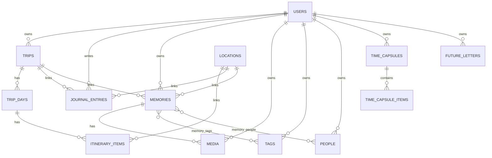

# Cronevia Database Architecture

## Stack
- Engine: MySQL 8+
- Primary app database: `cronevia`
- Test database: `cronevia_test` (or SQLite in-memory for fast unit runs)
- Charset: `utf8mb4`
- Collation: `utf8mb4_0900_ai_ci`

## Privacy Model
- All user-owned resources are scoped by `user_id` and protected by authentication plus policies.
- Frontend never connects to MySQL directly.
- Data path is Vue -> Laravel API -> Eloquent -> MySQL.

## Tables
- users
- trips
- trip_days
- itinerary_items
- locations
- journal_entries
- memories
- media
- people
- tags
- memory_people
- memory_tags
- time_capsules
- time_capsule_items
- future_letters

## Key Foreign Keys
- trips.user_id -> users.id (cascade)
- trip_days.trip_id -> trips.id (cascade)
- itinerary_items.trip_day_id -> trip_days.id (cascade)
- itinerary_items.location_id -> locations.id (set null)
- journal_entries.user_id -> users.id (cascade)
- journal_entries.trip_id -> trips.id (set null)
- journal_entries.location_id -> locations.id (set null)
- memories.user_id -> users.id (cascade)
- memories.trip_id -> trips.id (set null)
- memories.journal_entry_id -> journal_entries.id (set null)
- memories.location_id -> locations.id (set null)
- media.user_id -> users.id (cascade)
- media.memory_id -> memories.id (cascade)
- media.journal_entry_id -> journal_entries.id (set null)
- tags.user_id -> users.id (cascade)
- people.user_id -> users.id (cascade)
- memory_people.memory_id -> memories.id (cascade)
- memory_people.person_id -> people.id (cascade)
- memory_tags.memory_id -> memories.id (cascade)
- memory_tags.tag_id -> tags.id (cascade)
- time_capsules.user_id -> users.id (cascade)
- time_capsule_items.capsule_id -> time_capsules.id (cascade)
- future_letters.user_id -> users.id (cascade)

## Delete Behavior
- Hard owner delete behavior is controlled by FK cascades from `users`.
- App-level user-facing deletes use soft deletes for major resources.
- Optional links (trip/location/journal pointers) use `SET NULL` to preserve historical records where needed.

## Indexes And Unique Constraints
- `users.email` unique
- `trips`: index on `user_id`, `start_date`, `status`
- `trip_days`: unique (`trip_id`, `day_number`), index `date`
- `itinerary_items`: index (`trip_day_id`, `sort_order`)
- `journal_entries`: indexes `user_id`, `trip_id`, `entry_date`
- `memories`: indexes `user_id`, `trip_id`, `memory_date`
- `media`: indexes `user_id`, `memory_id`
- `locations`: indexes `latitude`, `longitude`
- `people`: index `user_id`
- `tags`: unique (`user_id`, `name`)
- `memory_tags`: unique (`memory_id`, `tag_id`)
- `memory_people`: unique (`memory_id`, `person_id`)
- `time_capsules`: indexes `user_id`, `unlock_at`
- `future_letters`: indexes `user_id`, `deliver_at`

## Time Capsule Security
- Locked capsules do not expose protected content before unlock.
- Unlock checks are backend-enforced using server time.

## Future Letter Security
- Letter content is encrypted at rest via model cast.
- Pre-unlock API responses omit protected letter content.

## Media Storage
- Binary media files are stored outside MySQL.
- MySQL stores ownership, metadata, and path pointers only.

## ERD
